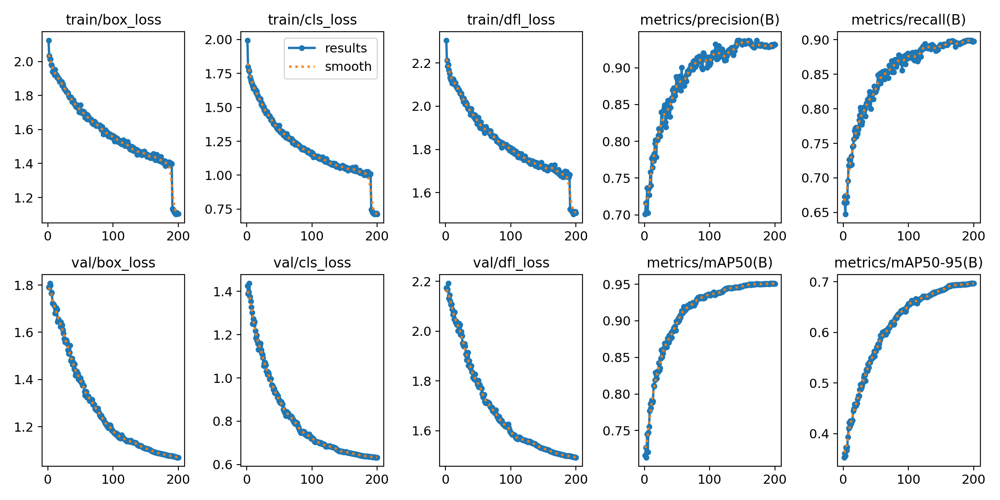
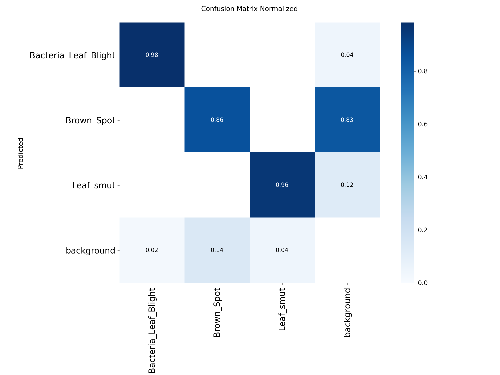
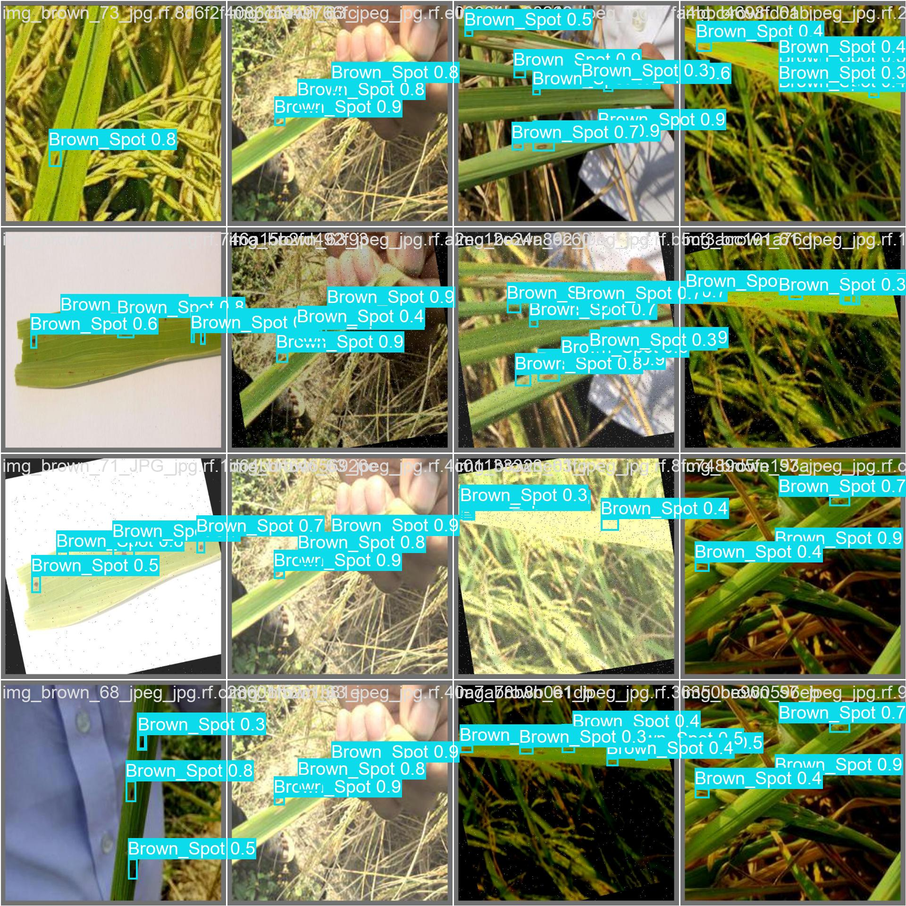

# TriDom-YOLO

面向复杂稻田环境的轻量级水稻病虫害检测模型。TriDom-YOLO 以 YOLO11 为基线，构建“频率增强 - 空间细化 - 门控筛选”的三域渐进式特征增强链，重点改善早期小病斑、周期性背景纹理、叶片遮挡与运动模糊场景下的检测表现。




## 研究目标

真实稻田图像通常同时存在三类挑战：病斑目标小且边缘弱，水稻叶片纹理会产生强背景干扰，田间采集又容易受到光照、抖动和模糊影响。单一空间域注意力难以同时处理这些问题，因此项目将特征增强拆分到三个互补域，并按信息质量逐级优化。

## 三域渐进式增强

### 1. PFAE：频率域增强

`C3k2_PFAE` 通过多尺度卷积分支与二维频率注意力提取不同尺度的病斑特征。FFT/IFFT 频率建模用于抑制稻田周期性纹理、强化病斑边缘，为后续空间处理提供更纯净的表示。

### 2. DI-SpAM：空间域细化

`DI_SpAM` 组合多分支膨胀深度卷积、SimpleGate 与通道注意力，在不显著扩大计算量的前提下聚合多尺度空间上下文，提升模糊、小目标与不规则病斑的定位能力。

### 3. Gated CNN：门控域筛选

`C2PSA_GatedCNNBlock` 在骨干网络高层执行自适应门控。模型根据空间位置动态保留有效响应、抑制冗余背景，再将高质量特征交给原生 YOLO11 Neck 和 Detect Head。

```text
Image
  -> YOLO11 stem
  -> C3k2_PFAE x 4       frequency-domain enhancement
  -> DI_SpAM             spatial-domain refinement
  -> C2PSA_GatedCNNBlock gated feature selection
  -> YOLO11 Neck + Head
  -> Rice disease detections
```

完整逐层结构见 [TriDom-YOLO_Complete_Architecture.md](TriDom-YOLO_Complete_Architecture.md)。

## 实验摘要

项目论文记录的三模块融合实验结果如下：

| 指标      | TriDom-YOLO | 相对 YOLO11n 基线 |
| --------- | ----------: | ----------------: |
| mAP50     |       79.5% |     +7.2 个百分点 |
| mAP50-95  |       58.3% |     +6.8 个百分点 |
| 小目标 AP |       72.3% |    +13.7 个百分点 |
| 推理速度  |      82 FPS |           -13 FPS |
| 参数量    |       4.5 M |            +1.9 M |

仓库同时保留了训练曲线、归一化混淆矩阵、验证集预测示例与 CSV 日志，便于复盘实验过程。

| 训练曲线                                                      | 归一化混淆矩阵                                                  |
| ------------------------------------------------------------- | --------------------------------------------------------------- |
|  |  |



## 代码入口

| 路径                                                 | 说明                      |
| ---------------------------------------------------- | ------------------------- |
| `ultralytics/change_model/PFAE.py`                   | 频率注意力与 PFAE 模块    |
| `ultralytics/change_model/Di_SpAM.py`                | 膨胀空间注意力模块        |
| `ultralytics/change_model/Gated_CNN_block.py`        | 门控 CNN 与 PSA 融合模块  |
| `ultralytics/cfg/models/11/yolo11DiSP_PFAE_CNN.yaml` | 完整 TriDom-YOLO 网络配置 |
| `ultralytics/nn/tasks.py`                            | 自定义模块注册与模型解析  |
| `train_yolov11.py`                                   | 可移植训练入口            |
| `docs/assets/portfolio/`                             | 精选实验曲线与预测结果    |

## 快速开始

环境要求：Python 3.9+。训练建议使用支持 CUDA 的 PyTorch 环境。

```bash
git clone https://github.com/LiJunHaorr/tridom-yolo.git
cd tridom-yolo
pip install -e .
```

准备 YOLO 格式数据集配置，例如：

```yaml
path: /path/to/rice-dataset
train: images/train
val: images/val
test: images/test

names:
  0: Bacteria_Leaf_Blight
  1: Brown_Spot
  2: Leaf_smut
```

启动训练：

```bash
python train_yolov11.py \
  --data /path/to/rice.yaml \
  --weights yolo11n.pt \
  --epochs 200 \
  --batch 8 \
  --device 0
```

推理：

```python
from ultralytics import YOLO

model = YOLO("path/to/best.pt")
results = model.predict("path/to/rice-leaf.jpg", conf=0.25)
```

## 论文与文档

- [三域渐进式增强的水稻病虫害检测论文](论文_优化版_TriDom-YOLO三域渐进式增强的水稻病虫害检测.md)
- [完整网络结构说明](TriDom-YOLO_Complete_Architecture.md)
- [Ultralytics 官方文档](https://docs.ultralytics.com/)

## 开源说明

本项目基于 Ultralytics YOLO 修改并分发，遵循仓库中的 [AGPL-3.0 License](LICENSE)。Ultralytics、YOLO 及相关上游代码的权利归其各自权利人所有；本仓库重点展示 TriDom-YOLO 自定义模块、模型配置与水稻病虫害实验工作。
